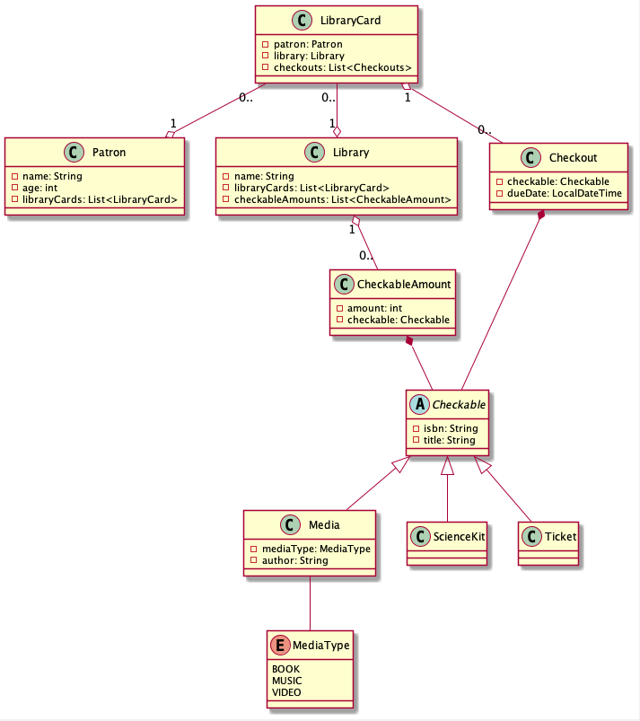

## Library Service

### Project Introduction

The purpose of this application is help keep track of the availability
of items which can be checked out from the libraries in our system.
In the current iteration, this is a readonly system, meaning we are only
interested in getting information out of the datastore and not interested
in adding any functionality around writing data.

Presently our data contains information about which items are available,
which libraries they belong to, and which are overdue for return. Each
patron of our libraries has one or more library cards, the cards keep track
of which items that patron has checked out, from where, and when they are
due. The libraries contain information about which items are available for
checkout and how many of each there are.

### Models

* `Checkout` - An abstract class representing any item that can be checked out.
* `CheckableAmount` - An intermediate class representing a quantity of a
particular `Checkout`.
* `Patron` - A person who owns a `libraryCard`.
* `Library` - A Library with a collection of `CheckableAmounts`.
* `LibraryCard` - A model which connects `Patron`s to `Library`s and keeps track
of the items from that `Library` the `Patron` has checked out.

Examine the following class diagram relating the models found within this project:



## Tasks

A brief summary of each Mastery Task follows below. 
Follow the links for a full description of each task, or
check out the `tasks` directory.

1. [MT01 Implement Dependency Injection](tasks/MT01%20Implement%20Dependency%20Injection.md)
Refactor the dependency management of the base project to make use of Spring's
DI framework capabilities. Remove constructors and replace with `@Autowired` 
field-injection annotations.
2. [MT02 Implement TDD Unit Test Behavior](tasks/MT02%20Implement%20TDD%20Unit%20Test%20Behavior.md)
Read over the tests in the `LibraryServiceTest` class and implement the
behaviors described by each unit test.
3. [MT03 Writing Unit Tests with Mocks](tasks/MT03%20Writing%20Unit%20Tests%20with%20Mocks.md)
Use mocking to write unit tests for the `CheckableService`. You must have
95% code coverage or more.

## Technical Information

### Required Naming Conventions
This project uses Reflection to ensure proper form with design patterns. Part
of this requires standardizing the names of certain class fields:
* All class fields must be camelcase 
    - e.g. `libraryService`.
* Do not abbreviate `@Autowired` fields 
    - e.g. `patronRepository` not `patRepo`
* You must use the proper annotation for Components 
    - e.g. `@Service`, `@RestController`.
    
### @JsonIgnoreProperties

This is a Spring annotation that informs Jackson (our JSON
transpiler) to ignore certain properties when displaying JSON
to the client.
* If the `@JsonIgnoreProperties` is placed above a class, then
Jackson will ignore the specified fields of that class.
* If the annotation is placed above a field, then Jackson
ignores the specified properties of that field when transpiling
the class.

This has two purposes. The first being that it makes our JSON
more readable to omit information that isn't necessary for the
viewer to navigate through. The second, is that it can help
prevent infinite loops between objects. The following example
will explain:

```
If we don't use @JsonIgnoreProperties and then display, say,
a Patron, then the JSON blob will include all of the properties
of each of the Patron's fields.

In this case that includes all of the Patron's LibraryCards- 
which is desired, except that, each LibraryCard has a Patron
field which will then be displayed in full.

So now the Patron's JSON blob contains all of its LibraryCards,
and each LibraryCard displays the full information of its Patron,
which includes that Patron's LibraryCards again!

And so on to infinity...
```

You do not need to implement any `@JsonIgnoreProperties` in this
project- they have already been implemented in the starter code.
This section is for your edification as you will encounter these
annotations as you explore the material.
    
### SeedData

This project uses a SeedData.java file to initialize the `Datastore`.
The Datastore filling in once again for a true database. Only
Repositories may interact with the `Datastore` directly.

The SeedData file will only run when the `src` directory's
`application.properties` is picked up by Spring. When tests
run, Spring picks up the `application.properties` file in the
`tst/resources` directory which has a property set to prevent
Spring from seeding the datastore. This is so we do not run
our tests using our actual database- a somewhat arbitrary but
very popular decision. Test data will be seeded directly in
the test classes `@BeforeEach` methods. However, when the project
runs through `App.main` or `LambdaHandler`, the seed data will
run and initialize the `Datastore`.

This functionality is provided by the `@ConditionalOnProperty`
annotation in `SeedData.java` which can choose to ignore or keep
the following annotation depending on the value of the condition.

### Views

This project makes use of a new concept called "views". These
are POJOs (plain ol' java objects) whose purpose is to
compile data from multiple sources so they can be bundled
together and sent and transmitted as a single object, or JSON
blob. Take a quick look at the classes under the `views`
directory and see they are nothing more than a couple of
fields and getters for those fields.

