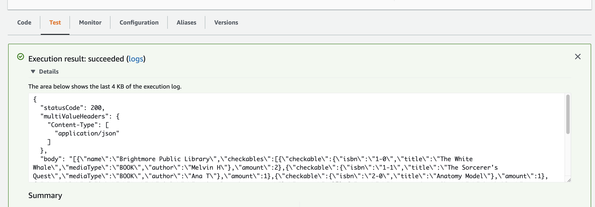

## Deploying on AWS Lambda

We can deploy our Spring application to AWS Lambda thanks to the
`SpringBootLambdaContainerHandler` class in the provided generic
`LambdaHandler` class. This is boilerplate code provided by Spring
specifically for Lambda deployment.

You can deploy this project to AWS Lambda just like any other, the
details are in what you send to the Handler. 

* Create a new Lambda Function and upload your project code. 
* Point it at the `handleRequest` method of the LambdaHandler class.
* Head to the Test tab and locate the test event `Template` 
drop-down.
    * Select `API Gateway AWS Proxy`
    
This template emulates a request sent from an API Gateway. We will
learn how to set up our a Gateway in a later unit.

This is a generic template full of dummy data, only some of it
we need, and even less should we bother modifying. Set the
`httpMethod` to `"GET"` and change the `path` to a viable path in
one of the `Controller`s.

You can save the event so that you don't lose it for later testing.

Press the `Test` button and make sure you get correct information
back.

### Completion

You have completed this mastery task upon receiving correct data
after pressing the `Test` button on the Lambda function.

If you send a request to `/libraries` for example, you should 
receive the following output:

```
{
  "statusCode": 200,
  "multiValueHeaders": {
    "Content-Type": [
      "application/json"
    ]
  },
  "body": "[{\"name\":\"Brightmore Public Library\",\"checkables...
  "isBase64Encoded": false
}
```
(Truncated to fit on your screen)

Here is a screenshot of the AWS Console:


